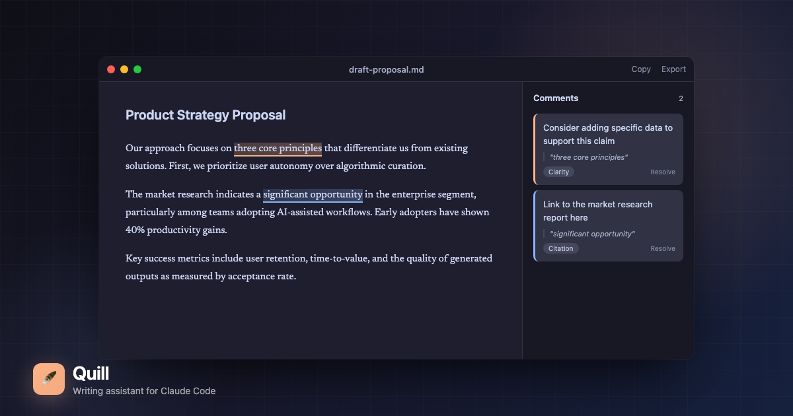

# Quill

A native macOS writing assistant that teaches Claude Code to write like you.



## What It Does

Quill lets you annotate your drafts with inline feedback, then exports structured prompts that Claude Code actually understands. Instead of describing edits from memory, your feedback stays anchored to the exact text.

**The workflow:**
1. Open a draft in Quill
2. Select text and add comments (Cmd+Shift+A)
3. Export for CLI (Cmd+Shift+E)
4. Run `quill` in your terminal to pass annotations to Claude Code

## Installation

### From Release

Download the latest `.dmg` from [Releases](https://github.com/szoloth/quill/releases).

### From Source

```bash
git clone https://github.com/szoloth/quill.git
cd quill
swift build -c release
# App bundle at .build/release/Quill.app
```

## CLI Integration

Quill exports to `~/.quill/document.json` on every save. Use the CLI tool to pipe this to Claude Code:

### Install CLI

```bash
# Copy to your agent-tools or add to PATH
cp cli/quill.js ~/agent-tools/
chmod +x ~/agent-tools/quill.js
```

### Commands

```bash
# Show current prompt from Quill
quill

# Open Claude Code with the prompt
quill edit

# Run compound-writing humanization
quill humanize

# Watch for changes and auto-notify
quill watch
```

### Ghostty Keybinding

Add to your `~/.config/ghostty/config`:

```
keybind = super+shift+q=text:\x1b:!quill edit\n
```

This lets you press Cmd+Shift+Q in Ghostty to immediately open Claude Code with your Quill annotations.

## Keyboard Shortcuts

| Shortcut | Action |
|----------|--------|
| ⌘ O | Open file |
| ⌘ S | Save |
| ⌘ ⇧ A | Add annotation |
| ⌘ ] | Next annotation |
| ⌘ [ | Previous annotation |
| ⌘ ⇧ C | Copy prompt to clipboard |
| ⌘ ⇧ E | Export for CLI |
| ⌘ ⌃ S | Toggle sidebar |
| ⌘ F | Find in document |

## Export Format

`~/.quill/document.json` contains:

```json
{
  "filepath": "/path/to/your/draft.md",
  "filename": "draft.md",
  "title": "draft",
  "content": "Full document text...",
  "wordCount": 270,
  "annotations": [
    {
      "id": "uuid",
      "text": "selected passage",
      "category": "REPHRASE",
      "severity": "should-fix",
      "comment": "Your feedback",
      "startOffset": 100,
      "endOffset": 150
    }
  ],
  "prompt": "Pre-generated prompt for Claude..."
}
```

## Integration with compound-writing

For AI-assisted writing, Quill integrates with the `compound-writing` skill for humanization:

```bash
# Run compound-writing on your annotated draft
quill humanize
```

This passes your document through a two-pass system:
1. **Diagnosis**: Scans for AI tells, rhythm issues, preserved facts
2. **Reconstruction**: Rewrites addressing your annotations while maintaining human voice

## Built With

- **SwiftUI** - Native macOS interface
- **AppKit** - NSTextView integration for the editor
- **Catppuccin Mocha** - Dark theme with Claude Code peach accent (#fab387)

## License

MIT
